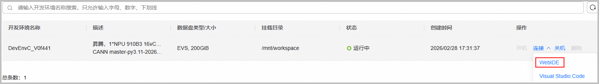

# 环境部署

在编译本项目之前，请您先参考下面步骤完成基础环境搭建，确保已安装NPU驱动、固件和CANN软件（`Ascend-cann-toolkit`）等。

## 环境安装

本项目提供多种搭建昇腾环境的方式，请按需选择。

| 安装方式 | 使用说明 | 使用场景 |
| ----- | ------ | ------ |
| CANNLab | 一站式开发平台，提供在线直接运行的昇腾环境，无需手动安装。 | 适用于没有昇腾设备的开发者。 |
| Docker | Docker镜像是一种高效部署方式，已预集成CANN包和必备依赖。 | 适用有昇腾设备，需要快速搭建环境的开发者。 |
| 手动安装 | 手动安装CANN包和基础依赖，灵活性高。 | 适用有昇腾设备，想体验手动安装CANN包或体验最新master分支能力的开发者。 |

### 方式1：CANNLab

对于无昇腾设备的开发者，可直接使用CANNLab云开发环境，即"一站式开发平台"，该平台为您提供在线可直接运行的昇腾环境，环境中已安装必备的驱动固件、软件包和依赖，无需手动安装。

> **说明**：环境默认安装最新商发版CANN包，源码下载时注意与软件配套。更多关于开发平台的介绍请参考[CANNLab指导](https://gitcode.com/org/cann/discussions/54)。

1. 进入开源项目，单击"`CANNLab`"按钮，使用已认证过的华为云账号登录。若未注册或认证，请根据页面提示进行注册和认证。

   

2. 根据页面提示创建NPU环境并配置规格，启动云开发环境后，单击"`连接 > WebIDE`"进入一站式开发平台。

   当前开源项目资源默认在`/mnt/workspace/gitCode/${gitCode_id}`目录下，${gitCode_id}表示开发者个人gitCode账号。

   

### 方式2：Docker部署

对于有昇腾设备的开发者，若您想快速搭建昇腾环境，可使用Docker镜像部署。

> **说明**：
>
> - 镜像文件比较大，下载需要一定时间，请您耐心等待。关于docker命令的选项介绍可通过`docker --help`查询。
> - 环境默认安装最新商发版CANN包，源码下载时注意与软件配套。

1. **安装驱动与固件**

   宿主机上昇腾驱动与固件的下载和安装操作请参考《[CANN软件安装指南](https://www.hiascend.com/document/redirect/CannCommunityInstWizard)》中"准备软件包"和"安装NPU驱动和固件"章节。

2. **下载镜像**

   - 步骤1：以root用户登录宿主机。确保宿主机已安装Docker引擎（版本1.11.2及以上），使用`docker --version`检查Docker版本，若没有，请参考[Docker官方安装指南](https://docs.docker.com/engine/install/)。
   - 步骤2：从[昇腾镜像仓库](https://www.hiascend.com/developer/ascendhub/detail/17da20d1c2b6493cb38765adeba85884)拉取已预集成CANN软件包及所需依赖的镜像。

   示例如下，请自行替换CANN版本号、芯片系列、操作系统、python版本信息。

    ```bash
    # 以cann:9.1.0-beta.1版本为例
    docker pull swr.cn-south-1.myhuaweicloud.com/ascendhub/cann:9.1.0-beta.1-910b-openeuler24.03-py3.12-devel
    ```

3. **运行Docker**

   拉取镜像后，需要以特定参数启动容器，以便容器内能访问宿主的昇腾设备。

    ```bash
    docker run --name cann_container --device /dev/davinci0 --device /dev/davinci_manager --device /dev/devmm_svm --device /dev/hisi_hdc -v /usr/local/dcmi:/usr/local/dcmi -v /usr/local/bin/npu-smi:/usr/local/bin/npu-smi -v /usr/local/Ascend/driver/lib64/:/usr/local/Ascend/driver/lib64/ -v /usr/local/Ascend/driver/version.info:/usr/local/Ascend/driver/version.info -v /etc/ascend_install.info:/etc/ascend_install.info -it swr.cn-south-1.myhuaweicloud.com/ascendhub/cann:9.1.0-beta.1-910b-openeuler24.03-py3.12-devel bash
    ```

    | 参数 | 说明 | 注意事项 |
    | :--- | :--- | :--- |
    | `--name cann_container` | 为容器指定名称，便于管理。 | 可自定义。 |
    | `--device /dev/davinci0` | 核心：将宿主机的NPU设备卡映射到容器内，可指定映射多张NPU设备卡。 | 必须根据实际情况调整：`davinci0`对应系统中的第0张NPU卡。请先在宿主机执行 `npu-smi info`命令，根据输出显示的设备号（如`NPU 0`, `NPU 1`）来修改此编号。|
    | `--device /dev/davinci_manager` | 映射NPU设备管理接口。 | - |
    | `--device /dev/devmm_svm` | 映射设备内存管理接口。 | - |
    | `--device /dev/hisi_hdc` | 映射主机与设备间的通信接口。 | - |
    | `-v /usr/local/dcmi:/usr/local/dcmi` | 挂载设备容器管理接口（DCMI）相关工具和库。 | - |
    | `-v /usr/local/bin/npu-smi:/usr/local/bin/npu-smi` | 挂载`npu-smi`工具。 | 使容器内可以直接运行此命令来查询NPU状态和性能信息。|
    | `-v /usr/local/Ascend/driver/lib64/:/usr/local/Ascend/driver/lib64/` | 关键挂载：将宿主机的NPU驱动库映射到容器内。 | - |
    | `-v /usr/local/Ascend/driver/version.info:/usr/local/Ascend/driver/version.info` | 挂载驱动版本信息文件。 | - |
    | `-v /etc/ascend_install.info:/etc/ascend_install.info` | 挂载CANN软件安装信息文件。 | - |
    | `-it` | `-i`（交互式）和 `-t`（分配伪终端）的组合参数。 | - |
    | `swr.cn-south-1.myhuaweicloud.com/ascendhub/cann:...` | 指定要运行的Docker镜像。 | 请确保此镜像名和标签（tag）与你通过`docker pull`拉取的镜像完全一致。 |
    | `bash` | 容器启动后立即执行的命令。 | - |

### 方式3：手动安装

对于有昇腾设备的开发者，若您想手动搭建昇腾环境，请参考下述步骤。

#### 安装软件

- **场景1：体验master版本能力或基于master版本进行开发**

    1. **安装驱动与固件**

        下载和安装操作请参考《[CANN软件安装指南](https://www.hiascend.com/document/redirect/CannCommunityInstWizard)》中"准备软件包"和"安装NPU驱动和固件"章节。

    2. **安装CANN toolkit包**

        请单击[下载链接](https://ascend.devcloud.huaweicloud.com/artifactory/cann-run-mirror/software/master/)，选择最新时间版本，并根据产品型号和环境架构下载对应包。

        ```bash
        # 确保安装包具有可执行权限
        chmod +x Ascend-cann-toolkit_${cann_version}_linux-${arch}.run
        # 安装命令
        ./Ascend-cann-toolkit_${cann_version}_linux-${arch}.run --install --quiet --install-path=${install_path}
        ```

    3. **安装CANN ops包**

        请在同一下载页面下载对应产品型号的ops包，安装路径需与toolkit包一致。

        ```bash
        chmod +x Ascend-cann-${soc_name}-ops_${cann_version}_linux-${arch}.run
        ./Ascend-cann-${soc_name}-ops_${cann_version}_linux-${arch}.run --install --quiet --install-path=${install_path}
        ```

        变量含义说明：

        - ${cann_version}：表示CANN包版本号。
        - ${arch}：表示CPU架构，如aarch64、x86_64。
        - ${soc_name}：表示NPU型号名称。
        - ${install_path}：表示指定安装路径，root用户默认安装在`/usr/local/Ascend`目录。

- **场景2：体验已发布版本能力或基于已发布版本进行开发**

    请访问[CANN官网下载中心](https://www.hiascend.com/cann/download)，选择发布版本，并根据产品型号和环境架构下载toolkit包和对应产品型号的ops包，最后参考网页提供的命令完成安装。

#### 安装基础依赖

本项目基础依赖如下，注意满足版本号要求。

- python >= 3.8（建议版本 <= 3.10）
- gcc >= 7.3.0
- cmake >= 3.16.0
- make

上述依赖可通过项目脚本一键安装，命令如下，若遇到不支持系统，请参考该文件自行适配。

```bash
bash install_deps.sh
```

#### 安装PyTorch

请访问[PyTorch官网](https://pytorch.org/get-started/locally/)，根据环境选择合适的安装命令。

```bash
pip install torch
```

#### 安装torch_npu

请访问 [torch_npu Releases](https://gitcode.com/Ascend/pytorch/releases)，根据CANN版本、PyTorch版本、Python版本和CPU架构（aarch64/x86_64）选择对应的whl包下载安装。

```bash
pip install torch_npu-*.whl
```

#### 安装Python依赖

```bash
pip install -r requirements.txt
```

## 环境验证

安装完CANN包后，需验证环境和驱动是否正常。

- **检查NPU设备**

   ```bash
   npu-smi info
   ```

- **检查CANN版本**

   ```bash
   # 查看CANN toolkit包版本信息（默认路径安装）
   cat /usr/local/Ascend/cann/${arch}-linux/ascend_toolkit_install.info  # Docker和手动安装场景
   cat /home/developer/Ascend/cann/${arch}-linux/ascend_toolkit_install.info  # CANNLab场景
   # 查看CANN ops包版本信息（默认路径安装）
   cat /usr/local/Ascend/cann/${arch}-linux/ascend_ops_install.info  # Docker和手动安装场景
   cat /home/developer/Ascend/cann/${arch}-linux/ascend_ops_install.info  # CANNLab场景
   ```

   其中${arch}可通过`uname -m`查询当前架构，如aarch64、x86_64。

## 环境变量配置

按需选择合适的命令使环境变量生效。

```bash
# 默认路径安装，以root用户为例（非root用户，将/usr/local替换为${HOME}）
source /usr/local/Ascend/cann/set_env.sh
# 指定路径安装
# source ${install_path}/cann/set_env.sh
```

## 源码下载

下载与CANN版本配套的分支源码，命令如下，`${tag_version}`替换为分支标签名。

```bash
git clone -b ${tag_version} https://gitcode.com/cann/ops-multimodal-fusion.git
```
